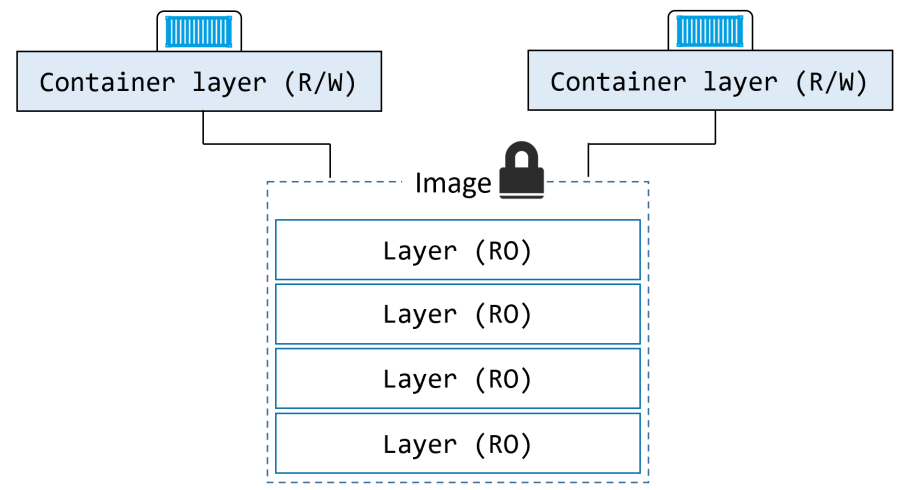

# Data inside Containers

## (heading to be deleted)> Data is the new gold

Container virtualization is a mordern technology that allows to host, configure and sclae multiple application on a single host. It is an alternative to traditional virtualization by a hypervisor. Containers are deployed using container images, which act as blueprint for the application.

 By design, containers should be immutable. That means they should be read-only. Instead of changing the configuration of a container inside the container, the container should be replaced by a new one with a changed configuration.
(Docker Deep Dive, 183)

 
Figure 2: Data is the new gold

Source: (Docker Deep Dive, 183)

&nbsp;

As shown in figure 2, additionally to the read-only image layers, container technology like Docker often a single writable layer. Most of the times it ist tightly coupled to the lifecycle of the container and gets deleted together with the container. (Docker Deep Dive, 183)

Explain that data is emphemeral

Explain that it differs from technology to technology