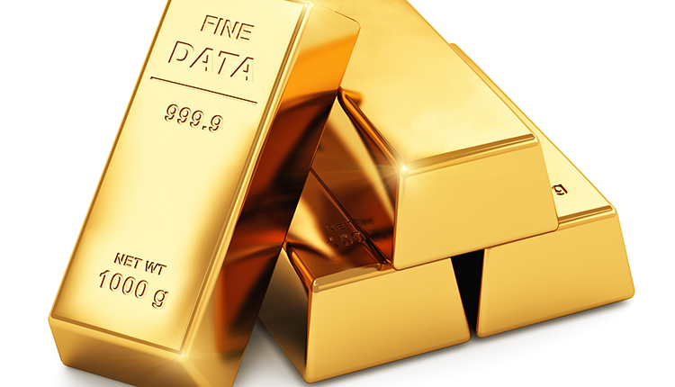

Figure 1: Data is the new gold

Source: [1]

&nbsp;

With the progress of digitalization and the increase of digital devices like Internet of things (IoT) and other devices, more and more data can be collected. This data offers a huge potential for all different kind of companies to profit off by analyzing this data. Overall, the importance of data has been growing over the past few years. Nowadays it has has became an invaluable asset. Here are few quotes to support this trend.

&nbsp;

> Data is the new gold

Source: [2]

&nbsp;

> Data as Asset, getting more and more important across all industries
> • Not only classical data-intensive companies like Google or Facebook
> • Increasing interest e.g. in insurance, health care, automotive, …
> • Connected cars, Smart Home, Tailor-made insurances, etc

Source: [3, pp. 18]
